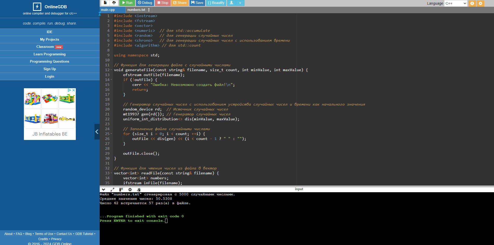

# Решение заданий по лабораторной работе

> `MPI (Message Passing Interface)` — это стандарт для передачи сообщений в распределенных вычислениях. Он широко используется для создания параллельных программ.

> На C++ можно использовать MPI через библиотеки, такие как OpenMPI или MPICH, с помощью стандартных вызовов API.

## Тема II.  Алгоритмы параллельного программирования

`Задание VI` Используя алгоритм «Портфель задач»,  написать программу.

Определить задачу, портфель, способ выхода из бесконечного цикла, решение задачи. Добавить в отчет.

### Вариант №1. Задача о медведе и пчелах

Есть n пчел и медведь. Они пользуются одним горшком меда, имеющим H порций меда. Сначала горшок пустой.
Пока горшок не наполнится, медведь спит, потом съедает весь мед и засыпает.
Каждая пчела многократно собирает одну порцию меда и кладет ее в горшок.
Пчела, которая приносит последнюю порцию и заполняет горшок, будит медведя.
Представить медведя и пчел процессами, разработать код, моделирующий их действия.

Использовать алгоритм «портфель задач». Написать программы на `MPI` и `OpenMP`

### Вариант №2. Задача о голодных птенцах

Есть n птенцов и их мать. Птенцы едят из общей миски, в которой F порций пищи.
Каждый птенец съедает порцию еды, спит некоторое время, затем снова ест.
Когда кончается еда, птенец, евший последним, зовет мать.
Птица наполняет миску 0<M≤F порциями еды и снова ждет, пока миска опустеет. Эти действия повторяются без конца.
Представить птиц процессами, разработать код, моделирующий их действия.

Использовать алгоритм «портфель задач». Написать программы на `MPI` и `OpenMP`

## Задание VII: Определение общего числа тредов и уникальных номеров тредов

Для выполнения этого задания, программа на OpenMP должна получить общее количество тредов и уникальные номера тредов.

## Задание VIII: Сложение матриц с использованием OpenMP

Для сложения матриц `a[n][n]` и `b[n][n]` с получением матрицы `c[n][n]`, можно использовать директиву `OpenMP` `#pragma omp parallel for schedule(dynamic)`.

## Задание IX: Решение системы ОДУ методом прогноз-коррекции

Для решения системы обыкновенных дифференциальных уравнений методом предиктор-корректора на OpenMP, потребуется последовательная программа, которую можно распараллелить с использованием OpenMP.

`Пример на основе метода Эйлера и предсказания`

## Тема IV. Алгоритм «MapReduce»

`Задание XI` Используя алгоритм MapReduce, написать программы.

Подготовить файл, содержащий более 5000 чисел.

Сделать вывод. Добавить в отчет.

### Вариант №1

1. Найти среднее арифметическое чисел в файле.
2. Найти число повторений некоторого числа в файле.

### Вариант 2

1. Найти число уникальных чисел в файле и их количество.

**Решение находится в файле:** `zadanie_1.cpp`

2. Найти математический размах чисел в файле.

**Решение находится в файле:** `zadanie_2.cpp`

Оба задания (решения) находятся в файле `main.cpp`

**Автор:** Дуплей Максим Игоревич

**TG:** @quadd4rv1n7

**Дата:** 28.12.2024
